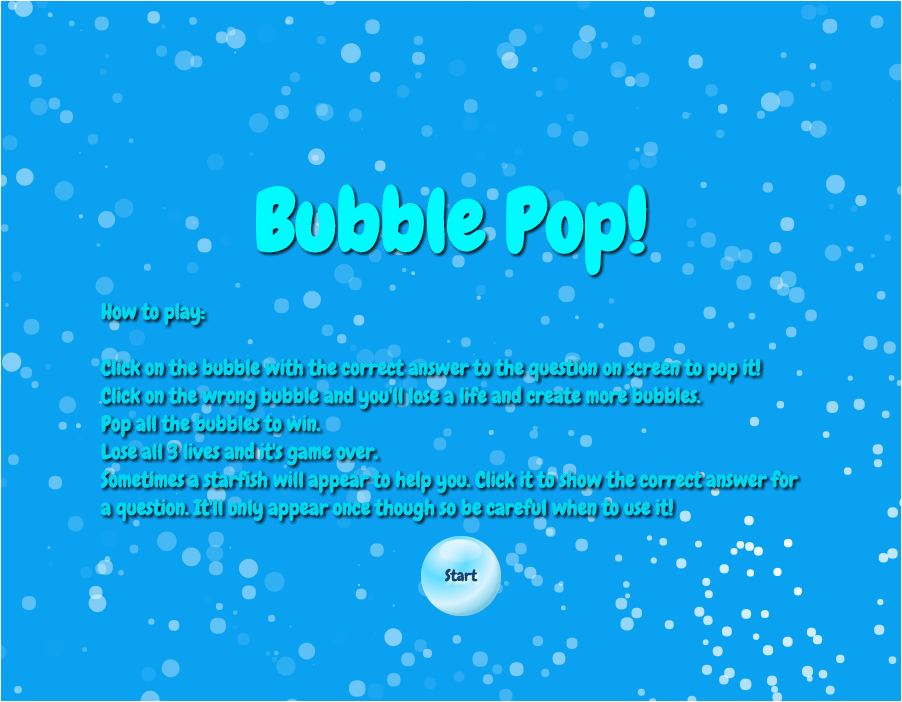
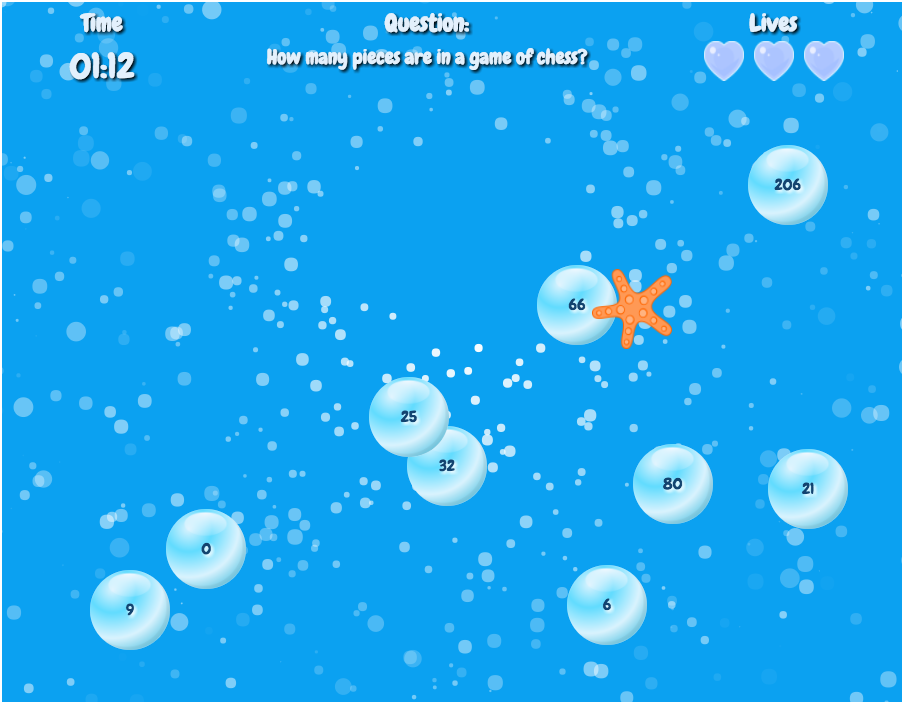
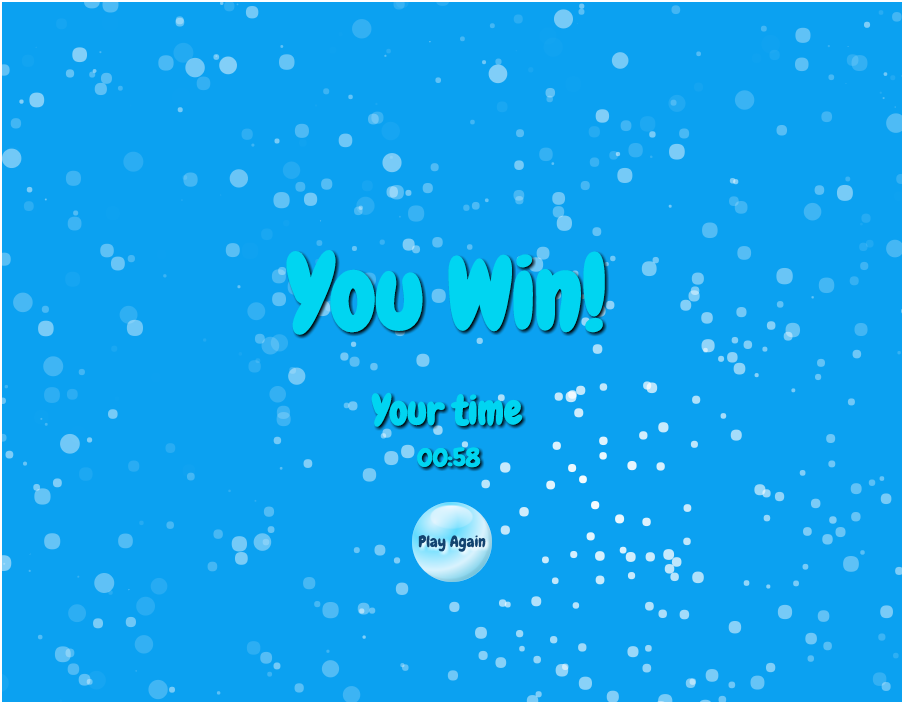
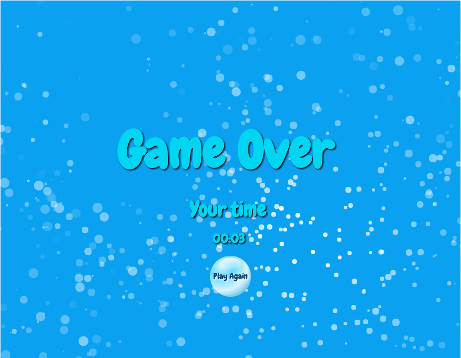

#Bubble Pop!

A bubble themed question based point and click game.

###How to run

To run the game, the folliwn gsteps must first be taken:

1. Clone/download the git repository.
2. In the terminal type: **npm install particles.js**
3. In the terminal type: **npm install --g bower**
4. In the terminal type: **bower install --save particles.js**
5. In the terminal type: **python -m SimpleHTTPServer 8000**
6. Go to **localhost:8000** in your browser.

###Instructions

How to play:

* Click on the bubble with the correct answer to the question on screen to pop it!
* Click on the wrong bubble and you'll lose a life and create more bubbles.
* Pop all the bubbles to win.
* Lose all 3 lives and it's game over.
* Sometimes a starfish will appear to help you. Click it to show the correct answer for a question. It'll only appear once though so be careful when to use it!

###Languages

The following languages have been used to build this program:

* HTML5
* CSS3
* Javascript with JQuery 3.2.1 and Particles.js 2.0.0 libraries.

###Gameplay

Main Menu with Instructions

